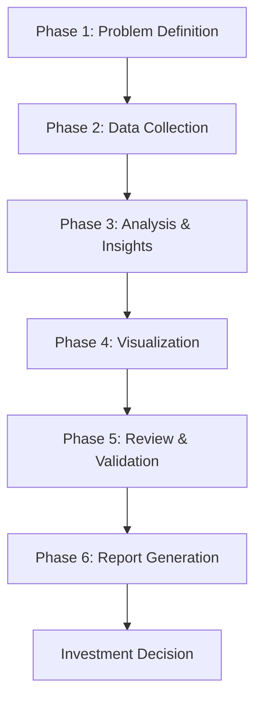

# Investment Analysis Methodology
## A Comprehensive Framework for Evaluating Indian Equities

---

## Table of Contents
1. [Executive Summary](#executive-summary)
2. [Framework Overview](#framework-overview)
3. [Phase 1: Problem Definition & Framework](#phase-1-problem-definition--framework)
4. [Phase 2: Data Collection](#phase-2-data-collection)
5. [Phase 3: Analysis & Insights](#phase-3-analysis--insights)
6. [Phase 4: Visualization](#phase-4-visualization)
7. [Phase 5: Review & Validation](#phase-5-review--validation)
8. [Phase 6: Report Generation](#phase-6-report-generation)
9. [Tools & Technologies](#tools--technologies)
10. [Templates & Checklists](#templates--checklists)
11. [Quality Assurance](#quality-assurance)

---

## Executive Summary

This methodology provides a systematic approach to conducting comprehensive investment analysis for Indian equities. It follows a 6-phase process that ensures thorough research, data-driven insights, and professional presentation of findings.

**Key Objectives:**
- Standardize the investment research process
- Ensure comprehensive coverage of all relevant factors
- Provide actionable investment recommendations
- Maintain consistency and quality across analyses

**Target Audience:**
- Individual investors
- Financial advisors
- Portfolio managers
- Research analysts

---

## Framework Overview

### The 6-Phase Process



### Core Analysis Areas

1. **Company Fundamentals**
   - Financial performance
   - Business model analysis
   - Management quality
   - Competitive positioning

2. **Industry Dynamics**
   - Market size and growth
   - Regulatory environment
   - Competitive landscape
   - Technology trends

3. **Valuation Analysis**
   - Current valuation metrics
   - Peer comparison
   - DCF modeling
   - Target price estimation

4. **Risk Assessment**
   - Business risks
   - Financial risks
   - Market risks
   - Regulatory risks

---

## Phase 1: Problem Definition & Framework

### 1.1 Define Investment Thesis

**Primary Questions to Answer:**
- What is the core investment opportunity?
- What makes this company attractive?
- What are the key risks and concerns?
- What is the recommended action?

**Example Template:**
```
Investment Thesis: [Company Name] presents a compelling opportunity in the [industry] sector due to [key factors]. 
The company is well-positioned to [growth drivers] while managing [risks]. 
Recommendation: [Buy/Hold/Sell] with target price of ₹[X] representing [Y]% upside/downside.
```

### 1.2 Establish Analysis Framework

**Four Key Areas:**

#### A. Company Overview
- Business model and operations
- Product/service portfolio
- Market position and competitive advantages
- Management team and governance

#### B. Financial Performance
- Revenue and profit growth trends
- Margin analysis
- Balance sheet strength
- Cash flow generation
- Return ratios

#### C. Industry Analysis
- Market size and growth projections
- Industry structure and dynamics
- Regulatory environment
- Competitive landscape

#### D. Investment Recommendation
- Valuation analysis
- Risk-reward assessment
- Target price and time horizon
- Key catalysts and risks

### 1.3 Create Analysis Checklist

**Company Fundamentals Checklist:**
- [ ] Business model clarity
- [ ] Revenue diversification
- [ ] Profitability trends
- [ ] Balance sheet health
- [ ] Management track record
- [ ] Corporate governance
- [ ] ESG compliance

**Industry Analysis Checklist:**
- [ ] Market size and growth
- [ ] Industry structure
- [ ] Regulatory environment
- [ ] Competitive positioning
- [ ] Technology disruption risks
- [ ] Supply chain dynamics

---

## Phase 2: Data Collection

### 2.1 Financial Data Sources

**Primary Sources:**
- **Yahoo Finance API**: Stock prices, financial statements, key metrics
- **Company Annual Reports**: Detailed financials, management commentary
- **SEBI Filings**: Regulatory disclosures, corporate actions
- **Stock Exchanges**: Real-time pricing, trading data

**Secondary Sources:**
- Research reports from brokerages
- Industry association reports
- Government publications
- Business news and analysis

### 2.2 Data Collection Process

**Step 1: Basic Company Information**
```python
# Example data points to collect
company_info = {
    'name': '',
    'sector': '',
    'industry': '',
    'market_cap': '',
    'current_price': '',
    'pe_ratio': '',
    'book_value': '',
    'dividend_yield': '',
    'roe': '',
    'roce': ''
}
```

**Step 2: Historical Financial Data**
- 5-year revenue and profit data
- Quarterly performance trends
- Balance sheet snapshots
- Cash flow statements

**Step 3: Industry and Market Data**
- Industry size and growth rates
- Market share data
- Regulatory developments
- Competitive landscape

### 2.3 Data Quality Checks

**Validation Criteria:**
- Data consistency across sources
- Timeliness of information
- Completeness of datasets
- Accuracy of calculations

---

## Phase 3: Analysis & Insights

### 3.1 Financial Performance Analysis

**Revenue Analysis:**
```python
def analyze_revenue_growth(revenue_data):
    """
    Calculate revenue CAGR and growth trends
    """
    years = len(revenue_data)
    cagr = ((revenue_data[-1] / revenue_data[0]) ** (1/(years-1)) - 1) * 100
    
    insights = {
        'cagr': cagr,
        'trend': 'increasing' if cagr > 0 else 'decreasing',
        'volatility': calculate_volatility(revenue_data),
        'acceleration': check_growth_acceleration(revenue_data)
    }
    
    return insights
```

**Profitability Analysis:**
- Gross margin trends
- Operating margin analysis
- Net profit margin evolution
- Return on equity (ROE)
- Return on capital employed (ROCE)

**Balance Sheet Strength:**
- Debt-to-equity ratio
- Current ratio
- Interest coverage ratio
- Asset quality assessment

### 3.2 Industry and Competitive Analysis

**Market Size and Growth:**
- Total addressable market (TAM)
- Serviceable addressable market (SAM)
- Market growth rate (CAGR)
- Market penetration analysis

**Competitive Positioning:**
- Market share analysis
- Competitive advantages (moats)
- Peer comparison metrics
- Industry structure (Porter's Five Forces)

### 3.3 Valuation Analysis

**Relative Valuation:**
- P/E ratio comparison with peers
- P/B ratio analysis
- EV/EBITDA multiples
- Price-to-sales ratio

**Absolute Valuation:**
- Discounted Cash Flow (DCF) model
- Dividend Discount Model (if applicable)
- Asset-based valuation

**Target Price Calculation:**
```python
def calculate_target_price(current_pe, eps_forecast, target_multiple):
    """
    Calculate target price based on valuation multiple
    """
    target_price = eps_forecast * target_multiple
    upside_potential = ((target_price - current_price) / current_price) * 100
    
    return {
        'target_price': target_price,
        'upside_potential': upside_potential,
        'valuation_method': 'P/E Multiple'
    }
```

---

## Phase 4: Visualization

### 4.1 Chart Types and Applications

**Financial Performance Charts:**
- Revenue and profit trend lines
- Margin evolution charts
- Balance sheet waterfall charts
- Cash flow diagrams

**Comparative Analysis:**
- Peer comparison bar charts
- Industry positioning scatter plots
- Valuation multiple comparisons
- Market share pie charts

**Growth Projections:**
- Market size forecasts
- Company growth projections
- Scenario analysis charts

### 4.2 Visualization Best Practices

**Design Principles:**
- Use consistent color schemes
- Include clear labels and titles
- Add data source references
- Ensure mobile responsiveness

**Color Scheme Example:**
```css
:root {
    --primary-green: #2E8B57;
    --accent-gold: #B8860B;
    --dark-green: #1F5F3F;
    --text-dark: #2C3E50;
}
```

### 4.3 Interactive Elements

**Recommended Features:**
- Hover effects for data points
- Clickable legends
- Zoom and pan capabilities
- Responsive design

---

## Phase 5: Review & Validation

### 5.1 Cross-Verification Process

**Data Validation:**
- Verify financial calculations
- Cross-check industry data
- Validate assumptions
- Confirm regulatory information

**Peer Review Checklist:**
- [ ] All data sources cited
- [ ] Calculations verified
- [ ] Assumptions documented
- [ ] Risks adequately covered
- [ ] Recommendation justified

### 5.2 Sanity Checks

**Financial Ratios:**
- Are the numbers realistic?
- Do they align with industry norms?
- Any red flags or anomalies?

**Market Assumptions:**
- Are growth projections reasonable?
- Do regulatory assumptions hold?
- Are competitive dynamics accurate?

### 5.3 External Validation

**Benchmark Comparisons:**
- Compare with analyst reports
- Check against industry benchmarks
- Validate with market data

---

## Phase 6: Report Generation

### 6.1 Report Structure

**Executive Summary:**
- Investment thesis
- Key findings
- Recommendation summary
- Risk highlights

**Main Sections:**
1. Company Overview
2. Financial Performance Analysis
3. Industry and Market Analysis
4. Competitive Positioning
5. Valuation Analysis
6. Investment Recommendation
7. Risk Assessment

### 6.2 Content Templates

**Executive Summary Template:**
```markdown
## Executive Summary

**Investment Thesis:** [One paragraph summary of the investment case]

**Key Findings:**
- Revenue CAGR: X% over Y years
- Profit CAGR: X% over Y years
- Market position: [Leading/Mid-tier/Emerging]
- Valuation: [Attractive/Fair/Expensive]

**Recommendation:** [BUY/HOLD/SELL]
- Target Price: ₹XXX
- Upside Potential: X%
- Time Horizon: X years
- Risk Rating: [Low/Moderate/High]
```

### 6.3 Visual Design Standards

**Layout Guidelines:**
- Professional color scheme
- Consistent typography
- Responsive design
- Clear section hierarchy

**Content Standards:**
- Maximum 1500 words
- Visualizations for key insights
- Data-driven conclusions
- Balanced risk-reward analysis

---

## Tools & Technologies

### Data Collection Tools
- **Yahoo Finance API**: Financial data
- **Web Scraping**: News and reports
- **SEBI Database**: Regulatory filings
- **Company Websites**: Annual reports

### Analysis Tools
- **Python**: Data analysis and visualization
- **Pandas**: Data manipulation
- **Matplotlib/Seaborn**: Chart creation
- **Jupyter Notebook**: Analysis workflow

### Visualization Libraries
```python
import matplotlib.pyplot as plt
import seaborn as sns
import plotly.graph_objects as go
import plotly.express as px
```

### Report Generation
- **HTML/CSS**: Professional reports
- **Markdown**: Content structure
- **Jinja2**: Template rendering
- **WeasyPrint**: PDF generation

---

## Templates & Checklists

### Analysis Checklist

**Pre-Analysis:**
- [ ] Define investment thesis
- [ ] Establish framework
- [ ] Identify data sources
- [ ] Set timeline

**Data Collection:**
- [ ] Gather financial data
- [ ] Collect industry information
- [ ] Research competitive landscape
- [ ] Review regulatory environment

**Analysis:**
- [ ] Calculate key metrics
- [ ] Perform peer comparison
- [ ] Assess valuation
- [ ] Identify risks

**Report Generation:**
- [ ] Create visualizations
- [ ] Write analysis sections
- [ ] Review and validate
- [ ] Generate final report

### Quality Metrics

**Data Quality Score:**
- Completeness (25%)
- Accuracy (25%)
- Timeliness (25%)
- Relevance (25%)

**Analysis Quality Score:**
- Depth of analysis (30%)
- Insightfulness (25%)
- Objectivity (25%)
- Actionability (20%)

---

## Quality Assurance

### Review Process

**Level 1: Self-Review**
- Check calculations
- Verify data sources
- Review assumptions

**Level 2: Peer Review**
- Independent validation
- Cross-check analysis
- Assess conclusions

**Level 3: Final Review**
- Overall coherence
- Recommendation validity
- Risk assessment

### Common Pitfalls to Avoid

**Data Issues:**
- Outdated information
- Inconsistent sources
- Calculation errors
- Missing context

**Analysis Issues:**
- Confirmation bias
- Overlooking risks
- Unrealistic assumptions
- Inadequate peer comparison

**Reporting Issues:**
- Unclear recommendations
- Insufficient risk disclosure
- Poor visualization
- Lack of actionable insights

---

## Conclusion

This methodology provides a structured approach to investment analysis that ensures:
- Comprehensive coverage of all relevant factors
- Data-driven insights and recommendations
- Professional presentation of findings
- Consistent quality across analyses

**Key Success Factors:**
1. Rigorous data collection and validation
2. Systematic analysis framework
3. Clear visualization of insights
4. Balanced risk-reward assessment
5. Actionable recommendations

By following this methodology, you can develop professional-quality investment analyses that provide valuable insights for investment decision-making.

---

*This methodology document is designed to be a living document that should be updated based on learnings and feedback from each analysis completed.*
